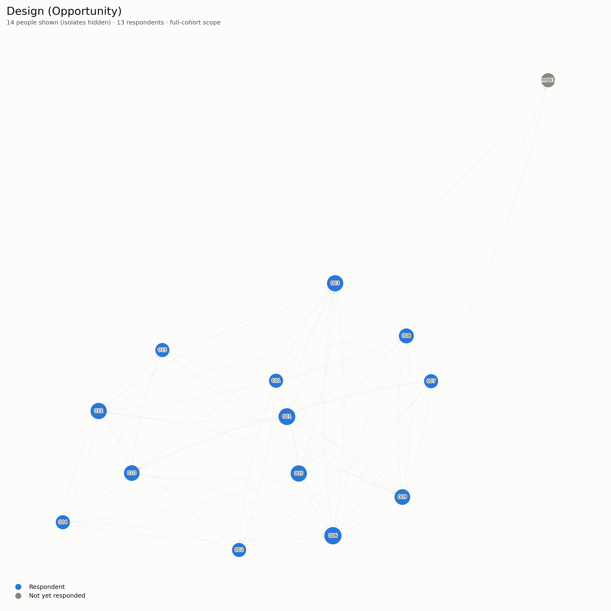

# People Picking Pipeline

Turns a raw Qualtrics download of the **People Picking** sociometric survey
exercise into anonymized per-person profiles, cohort-level statistics, and
network diagrams -- in one command, with no manual spreadsheet wrangling.

Originally built for the People Picking exercise in Mark Kennedy and Antoine
Vernet's Organisational Behaviour teaching (Imperial College Business School),
which asks respondents to pick cohort-mates for a mix of social and
task-focused scenarios (a friendship/social pick, an advice pick, and three
work-team picks: design, lobbying, implementation) and returns each person an
anonymized picture of their own "people picking" style relative to the
cohort. The underlying method -- pick networks, indegree-based popularity
scoring, IQ-style rescaling -- generalizes to any small-cohort sociometric
survey shaped the same way.



## What it does

From one raw CSV, the pipeline:

1. **Cleans** the export -- keeps the real header row, drops Qualtrics' two
   label rows, drops known metadata columns, excludes preview/test
   submissions and (by default) unfinished ones, shuffles row order, and
   assigns anonymous zero-padded ids.
2. **Builds adjacency matrices** for the five pick networks: design,
   lobbying, implementation, friendship, advice.
3. **Scores "popularity of your picks"** per network -- for each person, the
   summed indegree (how often *they* were picked by others) of everyone
   *they* picked -- then Z-scores it and rescales it to an IQ-style metric
   (mean 100, SD 15): `nQ(O)` Design/Opportunity, `nQ(I)` Lobbying/Influence,
   `nQ(C)` Implementation/Cohesion, `nQ(F)` Friendship, `nQ(A)` Advice, plus a
   combined Design+Lobbying+Implementation omnibus (`nQ(*)_unique` /
   `nQ(*)_dupe`) and a variability score `nQ(V)` (how much a person varies
   their picks across the three task teams).
4. **Draws a network diagram** for each of the five networks.
5. **Writes per-person profile CSVs** (+ a zip) and an id&harr;email map for
   mail-merging results back to participants, plus cohort summary stats, a
   correlation table, and simple regressions of friendship popularity against
   task-pick popularity.
6. **Writes `DATA_DICTIONARY.md`** into the output folder describing every
   file it produced -- including which scope and filtering choices this run
   used, so a cohort summary is self-documenting months later.

Nothing here reads or writes the raw survey data anywhere but your machine;
the tool has no network calls.

## Quick start

```bash
git clone https://github.com/REPLACE_ME/people-picking-pipeline.git
cd people-picking-pipeline
python3 -m venv .venv && source .venv/bin/activate
pip install -r requirements.txt

# try it on the bundled synthetic example data first
python people_picking_pipeline.py \
  --in examples/example_raw_qualtrics.csv \
  --outdir examples/example_output \
  --roster examples/example_roster.csv

# then run it on your own export
python people_picking_pipeline.py --in your_raw_qualtrics_export.csv --outdir out
```

Open `out/DATA_DICTIONARY.md` first -- it explains every file `out/` now
contains, and records exactly which scope/filtering flags this run used.

## Network scope: respondent-only vs. full cohort

By default the pipeline only counts a pick if **both** people responded to
the survey ("respondent-only" scope). That's fine once collection is
complete, but while responses are still coming in it silently *undercounts*
popularity: if you picked someone popular who simply hasn't submitted their
own survey yet, that popularity doesn't count toward your score.

Pass `--roster your_full_cohort.csv` (one column, `full_name`, one person per
row -- covering the *whole* cohort, not just respondents) to switch to
**full-cohort scope**: every named pick counts toward its target's indegree,
whether or not that person has responded. Non-respondents get their own
anonymous id (prefixed `nr`) and show up grey in the network diagrams and in
`roster_full_cohort.csv`, but never get a profile of their own (they didn't
submit one).

Scores under the two scopes are not directly comparable -- pick whichever
scope you're using consistently for the run and say so when sharing results
(the auto-generated `DATA_DICTIONARY.md` already does this for you).

## Row filtering

By default the pipeline drops:

- **Preview/test rows** (`DistributionChannel == preview`, or a blank
  respondent name) -- these are your own test submissions while building the
  survey, not real data.
- **Unfinished submissions** (`Finished == False`) -- partial responses.

Override either with `--include-preview` / `--include-unfinished` if you
want them counted (for instance, to compare against a prior year's run that
didn't filter them).

## CLI reference

```
python people_picking_pipeline.py --in RAW.csv --outdir OUTDIR
    [--seed 42]                Row-shuffle seed, for reproducible anonymous ids
    [--roster roster.csv]      Full-cohort scope (see above)
    [--include-preview]        Keep preview/blank rows (dropped by default)
    [--include-unfinished]     Keep Finished=False rows (dropped by default)
    [--no-viz]                 Skip the five network diagrams
    [--cohort-pack]            Extra PNGs + a PDF slide deck (3D scatter,
                                friendship-vs-task-pick regressions, a
                                correlation heatmap)
```

## Adapting it to your own survey

The pipeline assumes five pick-type columns named `friendship`, `advice`,
`design`, `lobby`, `implement` in the raw export (renamed internally to
`fPicks`/`aPicks`/`dPicks`/`lPicks`/`iPicks`) -- edit `RENAME_MAP` and
`PICK_COLS` near the top of `people_picking_pipeline.py` if your survey uses
different question names or a different number of pick networks. Everything
downstream (adjacency matrices, popularity scoring, diagrams) works off those
two constants.

## Repo layout

```
people_picking_pipeline.py   the whole tool -- one file, one entry point
examples/
  make_example_data.py       regenerates the fictional example dataset
  example_raw_qualtrics.csv  synthetic "raw download" (fake names/emails)
  example_roster.csv         synthetic full-cohort roster
  sample_network_design.png  a diagram from that example, for this README
tests/
  test_pipeline.py           smoke tests + a few invariant checks
```

## Privacy

Real survey exports contain names and email addresses -- **do not commit
them**. `.gitignore` in this repo excludes all CSVs except the synthetic
`examples/example_*` files and ignores every pipeline output folder by
default. If you fork this for your own cohort, keep your raw data and run
outputs out of version control (or in a private repo you control access to).

## License

MIT -- see [LICENSE](LICENSE).
